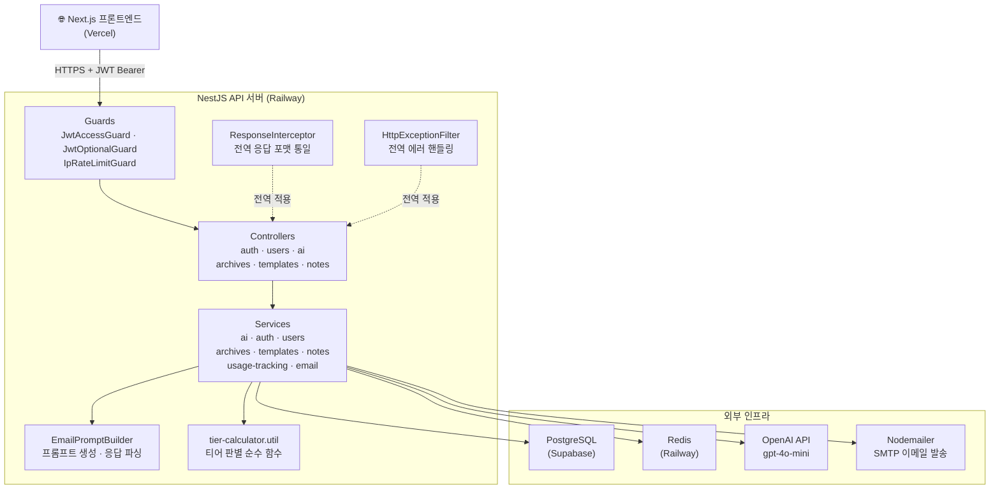

# SayitRight

<p align="center">
  
</p>

무엇을 어떻게 쓸지 고민하는 시간을 줄입니다.

SayItRight는 **이메일 초안을 상황에 맞게 정제**하고, 아카이브·템플릿·표현 노트를 통해 **사용자의 커뮤니케이션 역량을 축적**할 수 있도록 설계된 서비스입니다.

<p align="center">
  🌐 <a href="https://sayitright-web.vercel.app">서비스 페이지</a> &nbsp; | &nbsp;
  🖥️ <a href="https://github.com/kw9212/sayitright-web">프론트엔드 리포지토리</a> &nbsp; | &nbsp;
  📖 <a href="http://43.201.99.231:3001/api">Swagger API 문서</a> &nbsp;
</p>

## 📑 목차

- [📝 프로젝트 동기](#-프로젝트-동기)
- [⭐ 핵심 기능 요약](#-핵심-기능-요약)
  - [✍️ 이메일 작성](#️-이메일-작성)
  - [🔖 템플릿 전환 기능](#-템플릿-전환-기능)
  - [📋 아카이브 저장 기능](#-아카이브-저장-기능)
  - [📔 직장 생활 용어 노트](#-직장-생활-용어-노트)
- [📚 기술 스택](#-기술-스택)
- [📖 API 문서 (Swagger)](#-api-문서-swagger)
- [🏗️ 아키텍처](#️-아키텍처)
- [📁 디렉토리 구조](#-디렉토리-구조)
- [🛠️ 기술 상세](#️-기술-상세)
  - [1. OpenAI 프롬프트 빌더 패턴 (EmailPromptBuilder)](#1-openai-프롬프트-빌더-패턴-emailpromptbuilder)
  - [2. IP 기반 Rate Limiting (게스트 전용 Guard)](#2-ip-기반-rate-limiting-게스트-전용-guard)
  - [3. Prisma 복합키 + Upsert (일일 사용량 추적)](#3-prisma-복합키--upsert-일일-사용량-추적)
  - [4. 티어 계산 로직 분리 (tier-calculator.util.ts)](#4-티어-계산-로직-분리-tier-calculatorutilts)
  - [5. Guard 조합 패턴으로 인증/인가 분리](#5-guard-조합-패턴으로-인증인가-분리)
- [🎢 Challenges](#-challenges)
  - [AI 프롬프트 설계: 유저의 초안을 어떻게 완성된 이메일로 바꿀까?](#ai-프롬프트-설계-유저의-초안을-어떻게-완성된-이메일로-바꿀까)
- [✒️ 회고](#️-회고)

<br/>

## 📝 프로젝트 동기

우리는 하루 중 일정 시간을 이메일을 확인하고 작성하는 데 사용합니다.
누군가는 이메일 확인으로 하루를 시작하기도 하고, 누군가는 특정 시간대를 따로 정해 이메일을 처리하기도 합니다.

하지만 이메일은 AI에게 전달하는 프롬프트처럼 마음 편하게 작성하기 어렵습니다.
어떤 상황인지, 수신자는 누구인지, 어떤 목적을 가지고 있는지, 혹시 빠진 내용은 없는지까지 여러 번 검토한 뒤에야 보내게 됩니다. 특히 업무 이메일일수록 이러한 꼼꼼함은 필수적이며 중요한 과정입니다.

이러한 특성 때문에 이메일 작성에서 오는 피로도는 쉽게 누적됩니다.
이메일 작성과 확인에 많은 에너지를 쓰다 보면 다른 업무에 온전히 집중하기 어려워지기도 합니다. 심지어 그렇게 시간을 들여 작성했음에도 불구하고 표현이 아쉽거나 작은 실수가 발생하기도 합니다. 피로도가 누적될수록 이런 실수가 발생할 가능성도 자연스럽게 높아집니다.

그래서 이런 생각을 하게 되었습니다.

> 키워드와 상황만 입력하면 자연스럽게 이메일을 작성해주는 서비스가 있다면, 불필요한 피로도는 줄이고 실수 가능성도 낮추면서 매번 일정한 퀄리티의 이메일을 작성할 수 있지 않을까? 🤔

SayItRight은 이러한 고민에서 출발한 서비스입니다.

<br/>

## ⭐ 핵심 기능 요약

### ✍️ 이메일 작성

누구에게 쓰는 이메일인지,
어떤 말투가 적절한지,
어느 정도 길이가 알맞은지 고민할 필요가 없습니다.

초안에 의도만 담아 입력하고,
수신자·목적·톤과 같은 조건을 선택하면
상황에 맞게 정제된 이메일을 생성해줍니다.

고급 기능을 사용할 경우,
작성된 이메일에 대해 표현 선택의 이유와 개선 포인트를 설명하는 피드백도 함께 제공해
의도를 더 명확하게 파악할 수 있습니다.

---

### 🔖 템플릿 전환 기능

자주 사용하는 표현이나 구조가 있다면
생성된 이메일을 템플릿으로 저장해 재사용할 수 있습니다.

템플릿은 수정이 가능하며,
검색 기능을 통해 필요한 템플릿을 빠르게 찾을 수 있습니다.

---

### 📋 아카이브 저장 기능

이전에 작성한 이메일이 기억나지 않아도 괜찮습니다.
생성한 이메일은 모두 아카이브에 저장되어
날짜, 수신자, 내용, 키워드 검색을 통해 쉽게 찾아볼 수 있습니다.

여러 이메일을 관리해야 하는 상황에서도
필요한 내용을 빠르게 다시 확인할 수 있습니다.

---

### 📔 직장 생활 용어 노트

새로운 팀이나 조직에서 사용하는 사무 용어, 팀 내 표현이 낯설게 느껴진 적이 있다면
용어 노트 기능을 통해 나만의 정리 노트를 만들 수 있습니다.

각 용어마다 설명과 예시를 함께 기록할 수 있고,
중요한 항목은 표시해 한눈에 확인할 수 있습니다.

반복해서 정리하고 활용하며,
새로운 환경에 보다 빠르게 적응할 수 있도록 돕습니다.

<br/>

## 📚 기술 스택

- NestJS
- TypeScript
- Prisma
- Redis
- JWT
- OpenAI API
- Nodemailer
- Swagger

---

## 📖 API 문서 (Swagger)

🔗 **[http://43.201.99.231:3001/api](http://43.201.99.231:3001/api)**

NestJS Swagger UI로 모든 엔드포인트를 브라우저에서 직접 테스트할 수 있습니다.

| 그룹 | 경로 | 주요 기능 |
|---|---|---|
| **auth** | `/v1/auth/*` | 회원가입 · 로그인 · 구글 OAuth · 이메일 인증 · 토큰 재발급 |
| **users** | `/v1/users/*` | 내 정보 조회 · 프로필 수정 · 티어 변경 |
| **ai** | `/v1/ai/*` | 이메일 생성 (기본 / 고급) |
| **archives** | `/v1/archives/*` | 아카이브 목록 · 생성 · 수정 · 삭제 · 페이지네이션 |
| **templates** | `/v1/templates/*` | 템플릿 CRUD · 검색 |
| **notes** | `/v1/notes/*` | 용어 노트 CRUD · 별표 토글 |
| **health** | `/health` | 서버 상태 확인 |

> **인증 방법:** Swagger UI 상단 `Authorize` 버튼 → `Bearer <access_token>` 입력 후 잠금 해제

<br/>

## 🏗️ 아키텍처



<br/>

## 📁 디렉토리 구조

```
src/
├── main.ts                        # 앱 진입점 (Swagger, 전역 파이프·필터·인터셉터)
├── app.module.ts                  # 루트 모듈
│
├── ai/                            # 이메일 생성 (OpenAI)
│   ├── prompts/
│   │   └── email-prompt.builder.ts  # 프롬프트 빌더 패턴
│   ├── ai.controller.ts
│   ├── ai.service.ts
│   └── dto/
│
├── auth/                          # 인증 (JWT, Google OAuth, 이메일 인증)
│   ├── guards/
│   │   ├── jwt-access.guard.ts
│   │   └── jwt-optional.guard.ts
│   ├── auth.controller.ts
│   ├── auth.service.ts
│   └── dto/
│
├── users/                         # 사용자 프로필 · 티어 관리
├── archives/                      # 아카이브 CRUD + 페이지네이션
├── templates/                     # 템플릿 CRUD
├── notes/                         # 용어 노트 CRUD
│
├── email/                         # 이메일 발송 (Nodemailer)
│   ├── email.service.ts           # SMTP 발송
│   └── email-verification.service.ts  # 인증 코드 관리
│
├── redis/                         # Redis 모듈
│
├── common/                        # 공통 인프라
│   ├── guards/
│   │   └── ip-rate-limit.guard.ts   # IP 기반 Rate Limiting (인메모리)
│   ├── filters/
│   │   └── http-exception.filter.ts # 전역 예외 필터
│   ├── interceptors/
│   │   └── response.interceptor.ts  # 전역 응답 포맷 래핑
│   ├── services/
│   │   └── usage-tracking.service.ts  # 일일 사용량 추적
│   ├── utils/
│   │   └── tier-calculator.util.ts  # 티어 계산 순수 함수
│   └── types/
│
├── health/                        # 헬스체크 엔드포인트
│
└── test/                          # 테스트 헬퍼

prisma/
├── schema.prisma                  # DB 스키마
└── migrations/                    # 마이그레이션 이력

test/                              # E2E 테스트
```

<br/>

## 🛠️ 기술 상세

### 1. OpenAI 프롬프트 빌더 패턴 (EmailPromptBuilder)

**구현 과정:** 사용자 입력 + 여러 필터(relationship, purpose, tone, length)를 조합해 OpenAI API에 전달

**어려움:** 프롬프트 생성 로직이 복잡해지면서 Service 코드가 길어지고, 프롬프트 수정 시 부작용 위험

**해결:** `EmailPromptBuilder` 클래스로 system/user 프롬프트 생성과 응답 파싱 로직을 캡슐화. 응답 파싱은 `RATIONALE` / `FEEDBACK` / `피드백` 키워드와 `---` · `===` 구분자를 모두 허용하는 정규식으로 AI 응답 형식 변형에 유연하게 대응

**결과:** 프롬프트 수정이 `EmailPromptBuilder` 한 곳에서 관리되고, 테스트 가능한 순수 함수로 분리. 구분자 변형에 강건한 파싱으로 안정적인 응답 처리

---

### 2. IP 기반 Rate Limiting (게스트 전용 Guard)

**구현 과정:** 게스트 사용자가 이메일 생성 API를 무한 호출하면 OpenAI API 비용 폭탄 우려

**어려움:** 게스트는 userId가 없어서 일반적인 Rate Limiting 불가. Redis 도입은 초기 단계에서 오버엔지니어링

**해결:** NestJS Guard 패턴으로 `IpRateLimitGuard` 구현. 인메모리 Map으로 IP당 24시간 제한 적용. 요청 한도는 `getDailyRequestLimit('guest')`로 `tier-calculator.util.ts`와 단일 소스로 관리하여 정책 변경 시 한 곳만 수정. X-Forwarded-For 헤더로 프록시 환경 대응

**결과:** 게스트 남용 방지 + 추가 인프라 없이 빠른 응답 속도. 한도 정책이 tier-calculator와 일관되게 유지

---

### 3. Prisma 복합키 + Upsert (일일 사용량 추적)

**구현 과정:** 사용자별로 일일 이메일 생성 횟수(basic/advanced 구분) 및 토큰 사용량 추적. 매일 0시 자동 리셋

**어려움:** 동시 요청 시 카운팅 누락 또는 중복 위험. 날짜별 레코드를 수동으로 생성하면 race condition 발생

**해결:** `UsageTracking` 테이블에 `userId_date` 복합키(Composite Key) 설정. 카운팅 증가 경로(`incrementUsage`)에 Prisma upsert를 적용해 조회/생성/업데이트를 원자적으로 처리. 날짜 문자열(YYYY-MM-DD)로 날짜별 자동 분리

**결과:** 카운팅 증가 경로에서 race condition 없이 정확한 집계. 날짜가 바뀌면 자동으로 새 레코드 생성되어 리셋 로직 불필요

---

### 4. 티어 계산 로직 분리 (tier-calculator.util.ts)

**구현 과정:** 사용자 티어는 구독 상태(subscriptions)와 크레딧 잔액(creditBalance)에 따라 동적 결정

**어려움:** 여러 테이블을 조인하고 복잡한 비즈니스 로직을 Service에 넣으면 테스트와 재사용이 어려움

**해결:** 순수 함수 `calculateUserTier()`, `checkAdvancedFeatureAccess()`, `getDailyRequestLimit()` 등으로 분리. Prisma `include`로 필요한 데이터만 한 번에 조회 후 계산 함수에 전달

**결과:** 티어 로직이 Service(`ai.service`, `users.service`)와 Guard(`IpRateLimitGuard`)에서 동일한 함수로 재사용 가능. 단위 테스트로 엣지 케이스 검증 용이

---

### 5. Guard 조합 패턴으로 인증/인가 분리

**구현 과정:** 일부 API는 로그인 필수, 일부는 게스트 허용, 일부는 IP Rate Limit 추가 적용

**어려움:** 각 엔드포인트마다 인증 로직을 if문으로 체크하면 코드 중복 + 누락 위험

**해결:** 3가지 Guard를 라우트별로 조합

- `JwtAccessGuard`: 로그인 필수 엔드포인트 (토큰 없으면 401)
- `JwtOptionalGuard`: 게스트·로그인 모두 허용 (토큰 있으면 `req.user` 설정, 없으면 통과)
- `IpRateLimitGuard`: `JwtOptionalGuard` 뒤에 체이닝하여 게스트에만 Rate Limit 적용

**결과:** 라우터에 `@UseGuards()` 조합만 명시하면 인증 정책 자동 적용. 보안 정책이 코드에서 명시적으로 보이고, 각 Guard는 단위 테스트로 독립 검증 가능

---

## 🎢 Challenges

### AI 프롬프트 설계: 유저의 초안을 어떻게 완성된 이메일로 바꿀까?

예를 들어 보겠습니다.

처음 프로젝트를 구상할 때 목표로 삼았던 프로세스는 유저가 sayitright 이메일 작성 란에 다음과 같이 키워드만 적어도, 격식있고 공손하며 상황에 적절한 이메일로 변환해주는 것이었습니다.

> "팀장님 일정 지연 / 작업 생각보다 오래 / 오늘 완료 어려움 / 수정 더 필요 / 내일 가능할 듯 / 확인 부탁"

하지만 이를 구현하는 것은 생각보다 훨씬 복잡했습니다.

### 문제 상황: AI는 똑똑하지만 맥락을 모른다

초기에는 단순하게 접근했습니다. 사용자가 입력한 내용을 그대로 OpenAI API에 전달하면 되겠지, 라고요.

```typescript
// 초기 시도
const prompt = `다음 내용으로 이메일을 작성해주세요: ${userInput}`;
const response = await openai.chat.completions.create({
  messages: [{ role: 'user', content: prompt }],
});
```

하지만 결과는 예상과 다르게 의도와 전혀 다른 결과물을 생성했습니다.
예를 들어,

- "죄송합니다"를 입력하면 → 친구에게 보내는 듯한 캐주얼한 사과문이 생성됨
- "미팅 요청"을 입력하면 → 누구에게 보내는 건지 모호한 이메일이 생성됨
- 관계(교수님/상사/동료)와 목적(사과/요청/감사)이 명확하지 않으면 AI도 적절한 톤을 선택할 수 없었음

그래서 저는 이 문제를 사용자 입력에 관계, 목적, 톤, 길이 등의 **메타데이터**를 추가하여 AI에게 명확한 맥락을 제공해서 풀어보기로 했습니다.

하지만 또 다른 문제에 봉착했는데..

> 이 메타데이터들을 어떻게 조합할 것인가?

프롬프트 생성 로직이 Service 곳곳에 흩어지면 유지보수가 불가능해질 것 같았습니다.

고민하던 중 복잡한 객체의 생성 과정과 그 안에 들어가는 필드들을 분리하여 인스턴스를 구성하는 패턴인 [Builder 패턴](https://inpa.tistory.com/entry/GOF-%F0%9F%92%A0-%EB%B9%8C%EB%8D%94Builder-%ED%8C%A8%ED%84%B4-%EB%81%9D%ED%8C%90%EC%99%95-%EC%A0%95%EB%A6%AC)이라는 것을 알게 되었고 SayitRight 프로젝트에 도입해봤습니다.

```typescript
// src/ai/prompts/email-prompt.builder.ts
export class EmailPromptBuilder {
  static build(request: EmailGenerationRequest): { system: string; user: string } {
    return {
      system: this.getSystemPrompt(request.language),
      user: this.buildUserPrompt(request),
    };
  }

  private static buildUserPrompt(request: EmailGenerationRequest): string {
    const parts: string[] = [];

    // 1. 사용자 입력
    parts.push(`다음 내용을 바탕으로 이메일을 작성해주세요:\\n"${request.content}"\\n`);

    // 2. 메타데이터 조건 추가
    const constraints: string[] = [];
    if (request.relationship) {
      constraints.push(`- 수신자와의 관계: ${this.getRelationshipLabel(request.relationship)}`);
    }
    if (request.purpose) {
      constraints.push(`- 이메일 목적: ${this.getPurposeLabel(request.purpose)}`);
    }
    if (request.tone) {
      constraints.push(`- 톤: ${this.getToneLabel(request.tone)}`);
    }

    if (constraints.length > 0) {
      parts.push(`\\n다음 조건을 고려해주세요:\\n${constraints.join('\\n')}`);
    }

    // 3. 고급 기능: 개선 근거 요청
    if (request.includeRationale) {
      parts.push(
        `\\n\\n응답 형식:\\n` +
          `1. 먼저 완성된 이메일을 작성하고\\n` +
          `2. "---RATIONALE---" 구분자 다음에\\n` +
          `3. 왜 이렇게 작성했는지 개선 근거를 상세히 설명해주세요.`,
      );
    }

    return parts.join('');
  }
}
```

이제 프롬프트 생성은 한 곳에서 관리되고, Service는 비즈니스 로직에만 집중할 수 있게 되었습니다.

```typescript
// Service에서는 단순하게 호출
const prompts = EmailPromptBuilder.build({
  content: '죄송합니다',
  relationship: 'professor',
  purpose: 'apology',
  tone: 'formal',
  language: 'ko',
});

const response = await this.openai.chat.completions.create({
  messages: [
    { role: 'system', content: prompts.system },
    { role: 'user', content: prompts.user },
  ],
});
```

### 하지만 또 다른 문제: AI 응답을 어떻게 파싱할까?

MVP를 완성하고 새로운 기능을 추가하던 중, 이런 생각이 들었습니다.

> 🤔 MVP에서는 간단하게 처리하는 것을 구현했다면 이후 추가할 기능으로는 반대로 조금 더 섬세한 요청과 결과를 받아볼 수 있게 하면 어떨까?

그래서 추가한 것이 고급 기능입니다.

고급 기능을 사용하면 유저는 프롬프트를 조금 더 구체적인 조건으로 작성할 수 있습니다.

톤과 글자 수를 조정할 수 있고 다듬어진 이메일 뿐만 아니라 왜 그렇게 작성되었는지 **개선 근거**까지 받아볼 수 있게 됩니다.

문제는 이 두 가지를 어떻게 분리할 것인가였습니다.

```text
[AI 응답 예시]
안녕하세요 교수님,

어제 수업에 늦어 죄송합니다. 다음부터는...

(이메일 내용 계속)

---RATIONALE---
교수님께 보내는 사과 이메일이므로 격식있는 톤을 사용했고...
```

단순히 `split('---RATIONALE---')`을 쓸 수도 있지만, AI가 항상 정확히 이 형식을 지킬 거라는 보장은 없습니다. 대소문자를 섞어 쓸 수도 있고, 한글로 `---피드백---`이라고 쓸 수도 있죠.

이러한 문제는 **정규식 패턴 매칭**으로 대응했습니다.

```typescript
static parseResponse(aiResponse: string): { email: string; rationale?: string } {
  // 대소문자 구분 없이, 여러 구분자 형식 모두 대응
  const separatorPattern = /[-=]{3,}\\s*(RATIONALE|rationale|Rationale|피드백|FEEDBACK)\\s*[-=]{3,}/i;
  const match = aiResponse.match(separatorPattern);

  if (match) {
    const parts = aiResponse.split(separatorPattern);
    return {
      email: parts[0].trim(),
      rationale: parts[parts.length - 1].trim(),
    };
  }

  return {
    email: aiResponse.trim(),
  };
}
```

### 결과: 일관되고 유지보수 가능한 AI 통신

- **프롬프트 수정이 한 곳에서 관리**: 톤 추가, 언어 지원 확장 등이 Builder 클래스만 수정하면 됨
- **테스트 가능한 순수 함수**: Service와 분리되어 단위 테스트 작성 용이
- **방어적 파싱 설계**: 다양한 구분자 형식 대응 정규식 + 미매칭 시 전체 응답을 이메일로 반환하는 fallback으로 예외 없는 안정적 동작 보장
- **비즈니스 로직 집중**: Service는 티어 체크, 사용량 추적 등 핵심 로직에만 집중

<br/>

## ✒️ 회고

### 항상 전체를 생각하는 습관

기능 하나를 추가하는 일이 단순해 보일 때도, 실제로는 전체 구조와 얽혀 예상치 못한 충돌이 발생했습니다.

이번 프로젝트를 통해 당장의 구현에 집중하기보다, 설계 단계에서부터 시스템 전체에 미칠 영향을 먼저 고민하는 습관의 중요성을 배웠습니다.
