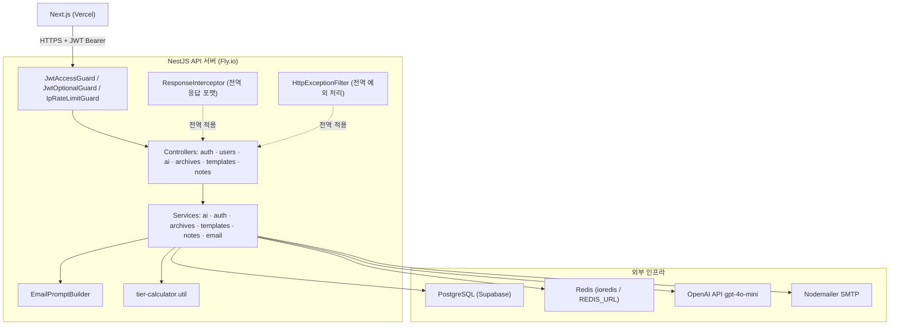

# SayitRight

<p align="center">
  
</p>

무엇을 어떻게 쓸지 고민하는 시간을 줄입니다.

SayItRight는 **이메일 초안을 상황에 맞게 정제**하고, 아카이브·템플릿·표현 노트를 통해 **사용자의 커뮤니케이션 역량을 축적**할 수 있도록 설계된 서비스입니다.

<p align="center">
  🌐 <a href="https://sayitright-web.vercel.app">서비스 페이지</a> &nbsp; | &nbsp;
  🖥️ <a href="https://github.com/kw9212/sayitright-web">프론트엔드 리포지토리</a> &nbsp; | &nbsp;
  📖 <a href="https://sayitright-api.fly.dev/api">Swagger API 문서</a> &nbsp;
</p>

## 📑 목차

- [📝 프로젝트 동기](#-프로젝트-동기)
- [⭐ 핵심 기능 요약](#-핵심-기능-요약)
  - [✍️ 이메일 작성](#️-이메일-작성)
  - [🔖 템플릿 전환 기능](#-템플릿-전환-기능)
  - [📋 아카이브 저장 기능](#-아카이브-저장-기능)
  - [📔 직장 생활 용어 노트](#-직장-생활-용어-노트)
- [📚 기술 스택](#-기술-스택)
- [📖 API 문서 (Swagger)](#-api-문서-swagger)
- [🏗️ 아키텍처](#️-아키텍처)
- [📁 디렉토리 구조](#-디렉토리-구조)
- [🧪 테스트](#-테스트)
- [🎢 Challenge](#-challenge)
  - [1. 사용자 초안을 상황에 맞는 이메일로 바꾸기](#1-사용자-초안을-상황에-맞는-이메일로-바꾸기)
  - [2. 게스트는 허용하되 AI API 남용은 막기](#2-게스트는-허용하되-ai-api-남용은-막기)
- [✒️ 회고](#️-회고)

<br/>

## 📝 프로젝트 동기

우리는 하루 중 일정 시간을 이메일을 확인하고 작성하는 데 사용합니다.
누군가는 이메일 확인으로 하루를 시작하기도 하고, 누군가는 특정 시간대를 따로 정해 이메일을 처리하기도 합니다.

하지만 이메일은 AI에게 전달하는 프롬프트처럼 마음 편하게 작성하기 어렵습니다.
어떤 상황인지, 수신자는 누구인지, 어떤 목적을 가지고 있는지, 혹시 빠진 내용은 없는지까지 여러 번 검토한 뒤에야 보내게 됩니다. 특히 업무 이메일일수록 이러한 꼼꼼함은 필수적이며 중요한 과정입니다.

이러한 특성 때문에 이메일 작성에서 오는 피로도는 쉽게 누적됩니다.
이메일 작성과 확인에 많은 에너지를 쓰다 보면 다른 업무에 온전히 집중하기 어려워지기도 합니다. 심지어 그렇게 시간을 들여 작성했음에도 불구하고 표현이 아쉽거나 작은 실수가 발생하기도 합니다. 피로도가 누적될수록 이런 실수가 발생할 가능성도 자연스럽게 높아집니다.

그래서 이런 생각을 하게 되었습니다.

> 키워드와 상황만 입력하면 자연스럽게 이메일을 작성해주는 서비스가 있다면, 불필요한 피로도는 줄이고 실수 가능성도 낮추면서 매번 일정한 퀄리티의 이메일을 작성할 수 있지 않을까? 🤔

SayItRight은 이러한 고민에서 출발한 서비스입니다.

<br/>

## ⭐ 핵심 기능 요약

### ✍️ 이메일 작성

누구에게 쓰는 이메일인지,
어떤 말투가 적절한지,
어느 정도 길이가 알맞은지 고민할 필요가 없습니다.

초안에 의도만 담아 입력하고,
수신자·목적·톤과 같은 조건을 선택하면
상황에 맞게 정제된 이메일을 생성해줍니다.

고급 기능을 사용할 경우,
작성된 이메일에 대해 표현 선택의 이유와 개선 포인트를 설명하는 피드백도 함께 제공해
의도를 더 명확하게 파악할 수 있습니다.

---

### 🔖 템플릿 전환 기능

자주 사용하는 표현이나 구조가 있다면
생성된 이메일을 템플릿으로 저장해 재사용할 수 있습니다.

템플릿은 수정이 가능하며,
검색 기능을 통해 필요한 템플릿을 빠르게 찾을 수 있습니다.

---

### 📋 아카이브 저장 기능

이전에 작성한 이메일이 기억나지 않아도 괜찮습니다.
생성한 이메일은 모두 아카이브에 저장되어
날짜, 수신자, 내용, 키워드 검색을 통해 쉽게 찾아볼 수 있습니다.

여러 이메일을 관리해야 하는 상황에서도
필요한 내용을 빠르게 다시 확인할 수 있습니다.

---

### 📔 직장 생활 용어 노트

새로운 팀이나 조직에서 사용하는 사무 용어, 팀 내 표현이 낯설게 느껴진 적이 있다면
용어 노트 기능을 통해 나만의 정리 노트를 만들 수 있습니다.

각 용어마다 설명과 예시를 함께 기록할 수 있고,
중요한 항목은 표시해 한눈에 확인할 수 있습니다.

반복해서 정리하고 활용하며,
새로운 환경에 보다 빠르게 적응할 수 있도록 돕습니다.

<br/>

## 📚 기술 스택

- NestJS
- TypeScript
- Prisma
- Redis
- JWT
- OpenAI API
- Nodemailer
- Swagger

---

## 📖 API 문서 (Swagger)

🔗 **[https://sayitright-api.fly.dev/api](https://sayitright-api.fly.dev/api)**

NestJS Swagger UI로 모든 엔드포인트를 브라우저에서 직접 확인할 수 있습니다. 로컬 실행 시에는 `http://localhost:3001/api`에서 같은 문서를 확인할 수 있습니다.

| 그룹 | 경로 | 주요 기능 |
|---|---|---|
| **auth** | `/v1/auth/*` | 회원가입 · 로그인 · 이메일 인증 · 비밀번호 재설정 · 토큰 재발급 · 로그아웃 |
| **users** | `/v1/users/*` | 내 정보 조회 · 프로필 수정 · 티어 변경 |
| **ai** | `/v1/ai/*` | 이메일 생성 (기본 / 고급) |
| **archives** | `/v1/archives/*` | 아카이브 목록 · 생성 · 수정 · 삭제 · 페이지네이션 |
| **templates** | `/v1/templates/*` | 템플릿 CRUD · 검색 |
| **notes** | `/v1/notes/*` | 용어 노트 CRUD · 별표 토글 |
| **health** | `/health` | 서버 상태 확인 |

> **인증 방법:** Swagger UI 상단 `Authorize` 버튼 → `Bearer <access_token>` 입력 후 잠금 해제

<br/>

## 🏗️ 아키텍처


```mermaid
flowchart TD
    Client["Next.js (Vercel)"]

    subgraph API["NestJS API 서버 (Fly.io)"]
        direction TB
        Guard["JwtAccessGuard / JwtOptionalGuard / IpRateLimitGuard"]
        Controller["Controllers: auth · users · ai · archives · templates · notes"]
        Service["Services: ai · auth · archives · templates · notes · email"]
        Interceptor["ResponseInterceptor (전역 응답 포맷)"]
        Filter["HttpExceptionFilter (전역 예외 처리)"]
        Builder["EmailPromptBuilder"]
        TierCalc["tier-calculator.util"]
    end

    subgraph Infra["외부 인프라"]
        DB["PostgreSQL (Supabase)"]
        Redis["Redis (ioredis / REDIS_URL)"]
        OpenAI["OpenAI API gpt-4o-mini"]
        Mailer["Nodemailer SMTP"]
    end

    Client -->|"HTTPS + JWT Bearer"| Guard
    Guard --> Controller
    Controller --> Service
    Service --> Builder
    Service --> TierCalc
    Interceptor -.->|전역 적용| Controller
    Filter -.->|전역 적용| Controller
    Service --> DB
    Service --> Redis
    Service --> OpenAI
    Service --> Mailer
```

<br/>

## 📁 디렉토리 구조

```
src/
├── main.ts                        # 앱 진입점 (Swagger, 전역 파이프·필터·인터셉터)
├── app.module.ts                  # 루트 모듈
│
├── ai/                            # 이메일 생성 (OpenAI)
│   ├── prompts/
│   │   └── email-prompt.builder.ts  # 프롬프트 빌더 패턴
│   ├── ai.controller.ts
│   ├── ai.service.ts
│   └── dto/
│
├── auth/                          # 인증 (JWT, 이메일 인증, Refresh Token 세션)
│   ├── guards/
│   │   ├── jwt-access.guard.ts
│   │   └── jwt-optional.guard.ts
│   ├── auth.controller.ts
│   ├── auth.service.ts
│   └── dto/
│
├── users/                         # 사용자 프로필 · 티어 관리
├── archives/                      # 아카이브 CRUD + 페이지네이션
├── templates/                     # 템플릿 CRUD
├── notes/                         # 용어 노트 CRUD
│
├── email/                         # 이메일 발송 (Nodemailer)
│   ├── email.service.ts           # SMTP 발송
│   └── email-verification.service.ts  # 인증 코드 관리
│
├── redis/                         # Redis 모듈
│
├── common/                        # 공통 인프라
│   ├── guards/
│   │   └── ip-rate-limit.guard.ts   # IP 기반 Rate Limiting (인메모리)
│   ├── filters/
│   │   └── http-exception.filter.ts # 전역 예외 필터
│   ├── interceptors/
│   │   └── response.interceptor.ts  # 전역 응답 포맷 래핑
│   ├── services/
│   │   └── usage-tracking.service.ts  # 일일 사용량 추적
│   ├── utils/
│   │   └── tier-calculator.util.ts  # 티어 계산 순수 함수
│   └── types/
│
├── health/                        # 헬스체크 엔드포인트
│
└── test/                          # 테스트 헬퍼

prisma/
├── schema.prisma                  # DB 스키마
└── migrations/                    # 마이그레이션 이력

test/                              # E2E 테스트
```

<br/>

## 🧪 테스트

단위 테스트는 **Jest (NestJS 기본 내장)**, E2E 테스트는 **Jest + Supertest**로 구성되어 있습니다.

| 구분 | 파일 수 | 테스트 케이스 |
|------|---------|-------------|
| 단위 테스트 (Jest) | 22개 | 285개 |
| E2E 테스트 (Jest + Supertest) | 5개 | - |

> E2E 테스트는 실제 PostgreSQL + Redis 환경이 필요합니다. (`npm run test:e2e:setup`으로 Docker 실행 후 진행)
> 현재 단위 테스트 중 일부 spec은 최신 구현과 불일치하여 보정이 필요합니다. 로컬 확인 기준 `18 passed / 4 failed`, `259 passed / 26 failed / 285 total` 상태입니다.

### 커버리지

현재 테스트 실패가 있어 최신 커버리지 수치는 별도로 갱신이 필요합니다. 테스트 전략은 DTO·모듈 설정 파일보다 **guards, interceptors, utils, 핵심 service 로직**처럼 정책 변경 위험이 큰 레이어를 우선 검증하는 방향입니다.

### 실행 방법

```bash
npm test              # 단위 테스트
npm run test:cov      # 커버리지 포함
npm run test:e2e      # E2E 테스트 (Docker 환경 필요)
```

<br/>

## 🎢 Challenge

### 1. 사용자 초안을 상황에 맞는 이메일로 바꾸기

**문제**

OpenAI API에 사용자 초안만 그대로 전달하면 원하는 품질의 이메일이 나오지 않았습니다. 예를 들어 "죄송합니다"라는 입력만으로는 친구에게 보내는 사과인지, 교수님께 보내는 사과인지 알 수 없습니다. "미팅 요청"도 수신자, 목적, 톤이 없으면 결과가 모호해집니다.

또 고급 기능에서는 이메일 본문과 개선 근거를 함께 받아야 했습니다. AI가 항상 같은 구분자로 응답하지 않기 때문에, 결과를 안정적으로 분리하는 문제도 있었습니다.

**고민**

프롬프트는 계속 바뀔 가능성이 높은 영역입니다. 관계, 목적, 톤, 길이 같은 조건이 늘어날수록 Service 안에서 문자열을 직접 만들면 이메일 생성의 비즈니스 흐름과 프롬프트 세부사항이 강하게 섞입니다.

그래서 핵심 고민은 "프롬프트를 잘 만드는 것"뿐 아니라, "프롬프트 변경이 Service 전체를 흔들지 않게 만드는 것"이었습니다.

**해결**

프롬프트 생성과 응답 파싱을 `EmailPromptBuilder`로 분리했습니다. 이 클래스는 언어에 맞는 system prompt를 만들고, 사용자 초안과 선택 조건을 모아 user prompt를 구성합니다.

개선 근거가 필요한 경우에는 AI에게 이메일 본문 뒤에 별도 구분자로 설명을 붙이도록 요청했습니다. 응답을 파싱할 때는 `RATIONALE`, `FEEDBACK`, `피드백`처럼 실제로 나올 수 있는 구분자 변형을 정규식으로 처리했습니다.

**결과**

`AiService`는 사용자 조회, 티어 계산, 사용량 체크, OpenAI 호출, 아카이브 저장이라는 흐름에 집중할 수 있게 되었습니다. 프롬프트 품질을 개선하거나 구분자 대응을 보강할 때는 `EmailPromptBuilder`만 보면 되므로 변경 범위가 명확해졌습니다.

---

### 2. 게스트는 허용하되 AI API 남용은 막기

**문제**

SayItRight의 이메일 생성 기능은 게스트도 사용할 수 있어야 했습니다. 하지만 게스트에게 AI 생성 API를 완전히 열어두면 OpenAI API 비용이 예측하기 어려워집니다.

반대로 이메일 생성 API를 로그인 필수로 만들면, 서비스의 핵심 가치를 체험하기 전에 회원가입을 요구하게 됩니다. 그래서 "게스트 접근 허용"과 "비용 통제"를 동시에 만족해야 했습니다.

**고민**

인증 정책은 엔드포인트마다 달랐습니다. 아카이브, 템플릿, 노트는 사용자 데이터이므로 로그인 필수입니다. 이메일 생성은 게스트도 통과해야 하지만, 게스트에게만 횟수 제한이 필요합니다.

이 로직을 Service 안에서 직접 분기하면, 새 API가 추가될 때 정책 누락이 생길 위험이 있습니다. 인증과 비즈니스 로직도 섞이게 됩니다.

**해결**

NestJS Guard를 조합했습니다. 로그인 필수 API에는 `JwtAccessGuard`를 사용했습니다. 이메일 생성 API에는 `JwtOptionalGuard`와 `IpRateLimitGuard`를 함께 적용했습니다.

`JwtOptionalGuard`는 토큰이 있으면 사용자 정보를 요청에 넣고, 토큰이 없으면 게스트로 통과시킵니다. 그 다음 `IpRateLimitGuard`가 로그인 사용자는 통과시키고, 게스트만 IP 기준으로 하루 요청 횟수를 제한합니다.

초기 단계에서는 인메모리 Map으로 IP별 카운터를 관리했습니다. 분산 서버 환경에서는 Redis 기반 rate limit으로 바꿔야 하지만, 현재 구현은 Guard 안에 격리되어 있어 교체 범위가 작습니다.

**결과**

이메일 생성 API는 게스트에게 열어두면서도 최소한의 비용 방어선을 갖게 되었습니다. 인증 정책은 라우트의 Guard 조합으로 드러나기 때문에 코드 리뷰 시 어떤 API가 어떤 보안 정책을 갖는지 파악하기 쉬워졌습니다.

---

## ✒️ 회고

### 항상 전체를 생각하는 습관

기능 하나를 추가하는 일이 단순해 보일 때도, 실제로는 전체 구조와 얽혀 예상치 못한 충돌이 발생했습니다.

이번 프로젝트를 통해 당장의 구현에 집중하기보다, 설계 단계에서부터 시스템 전체에 미칠 영향을 먼저 고민하는 습관의 중요성을 배웠습니다.
